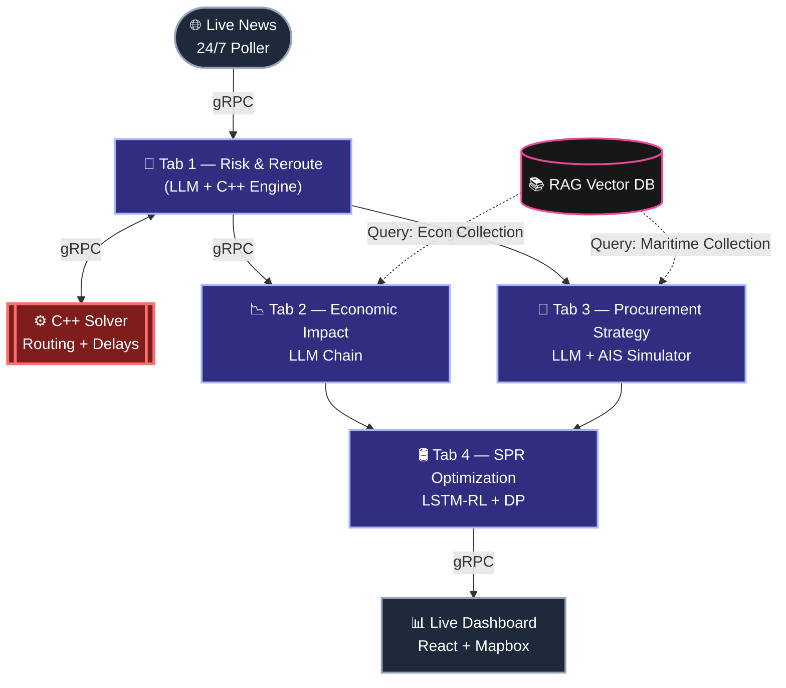

# AI-Driven Energy Supply Chain Resilience

Live news trips a **24/7 autonomous pipeline**: an LLM scores geopolitical risk, then a compiled **C++ engine** calculates optimal reroutes and network delays → two LLMs (executing in parallel) translate that into economic impact and procurement strategy → a final stage blends a trained **LSTM-RL policy** with a **dynamic-programming solver** into an SPR drawdown plan. Everything is glued together by **gRPC**, so C++, Python, and the React frontend all speak one strict, binary-fast contract.

*(Color = tab/stage · red = compiled native code · pink = knowledge base · dotted = RAG lookup.)*

## Architecture Highlights

- **Polyglot by design** — gRPC/Protobuf bridges C++ (deterministic math), Python (AI/RL), and JS (UI) into one system.
- **Fast & reliable** — binary serialization + strict typed contracts, not brittle JSON/REST.
- **True parallelism** — Tabs 2 & 3 run concurrently over a single HTTP/2 connection.
- **Autonomous 24/7** — a background poller watches real news and re-runs the full pipeline with zero manual input.

## End-to-End Stack Snapshot

**1. Presentation Layer (Frontend):** A live executive UI built with `React.js`, `Tailwind`, `Mapbox` (`GeoJSON`), and `WebSockets`.

**2. AI & Math Engines (The 4-Tab Core):**
| Tab | What it does | Core tech |
|---|---|---|
| 1 — Risk & Reroute | Scores chokepoint disruption risk + network delays | `LLM Sentiment Analysis` + `compiled C++` (Min Cost Max Flow via SPFA)|
| 2 — Economic | Cascades refinery → price → grid → macro impact | `LangChain Expression Language` (Multi-Persona AI chain) + `RAG` |
| 3 — Procurement | Recommends reroutes & spot-market buys | `LLM` + `RAG` |
| 4 — SPR | Optimizes strategic reserve drawdown | `AI Feature Extraction` + `RL (LSTM)` + `Dynamic Programming`|

**3. Orchestration & Infrastructure (Backend):** A high-speed polyglot architecture powered by `gRPC`/`Protobuf`, `FastAPI`, `ChromaDB`, and `Python asyncio`.
